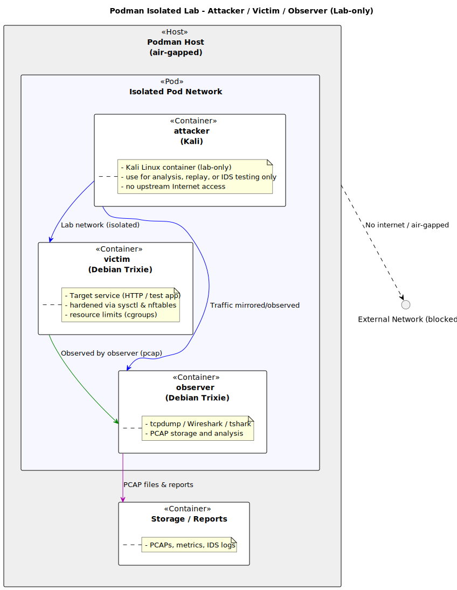

# ICMP Flood Lab
This lab demonstrates how to perform an ICMP flood attack using the `hping3` tool. An ICMP flood is a type of Denial of Service (DoS) attack that overwhelms a target system with ICMP Echo Request (ping) packets.

